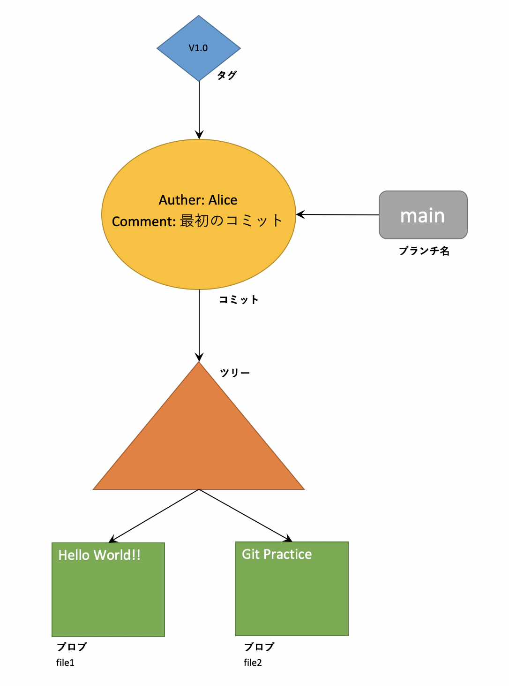
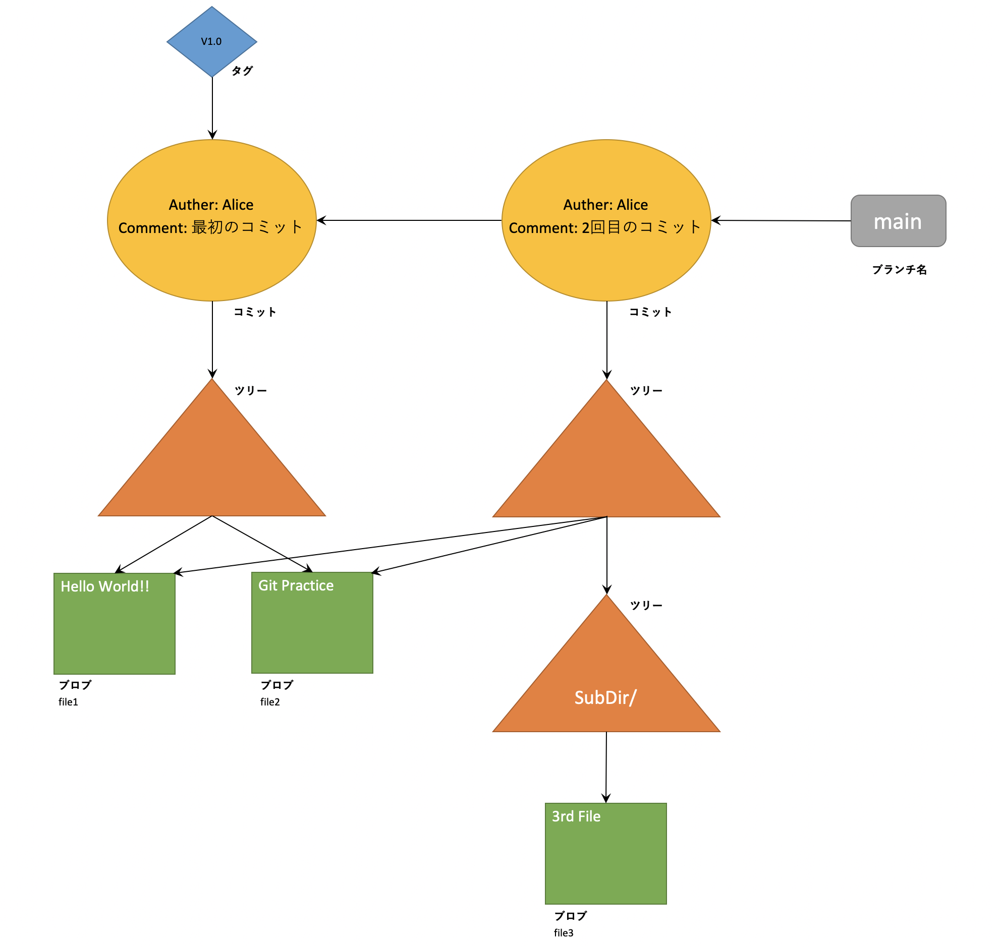

# Git Practice
## 基本概念
### リポジトリ(Repository)
Gitリポジトリは、プロジェクトのリビジョンと履歴を維持管理するのに必要な全情報を含むデータベース。

### Gitのオブジェクト
#### ブロブ(blob)
大きなバイナリオブジェクト(binary large object)のこと。ファイルの各バージョンはブロブで表される。

#### ツリー(tree)
1階層分のディレクトリ情報を表す。

#### コミット(commit)
リポジトリに加えられた各変更のメタデータ。

#### タグ(tag)
特定のオブジェクトに対して任意に設定できる名前。

#### インデックス
リポジトリ全体のディレクトリ構造が記述されたバイナリファイル。

---
## オブジェクトのイメージ
以下のコマンドを実行した場合のイメージ。

> $ git init  
$ echo "Hello World!!" > file1  
$ echo "Git Practice" > file2  
$ git add *  
$ git commit -m "最初のコミット"

この状態で以下のコマンドを実行した場合のイメージ。

> $ echo "3rd File" > SubDir/file3  
$ git add *  
$ git commit -m "2回目のコミット"

file1とfile2を示すブロブに変化はなく、2回目のコミット後も同じブロブを参照する。ツリーは1階層分のディレクトリ情報しか表すことができないのでSubDir以下に作成したfile3は別のツリーに紐付けられる。